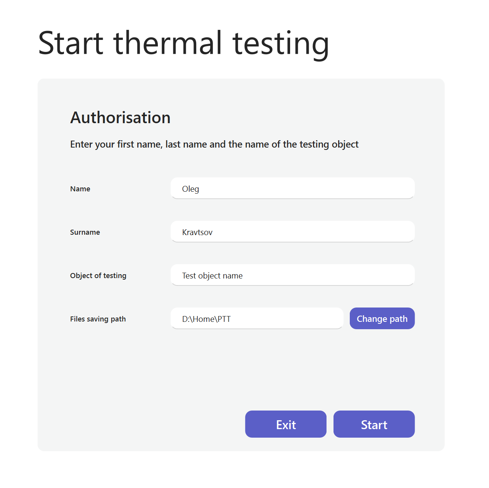
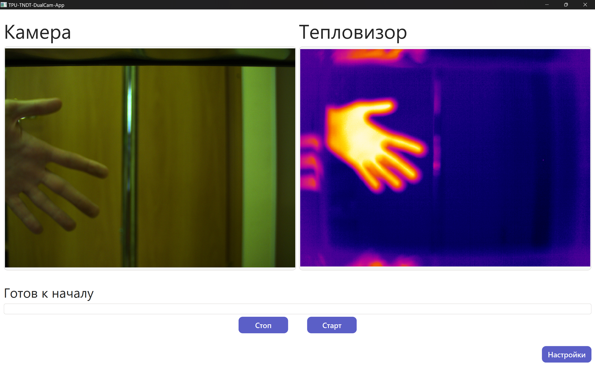
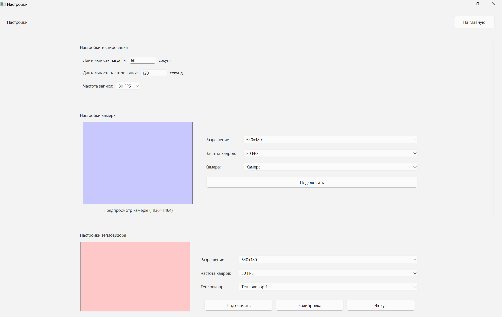
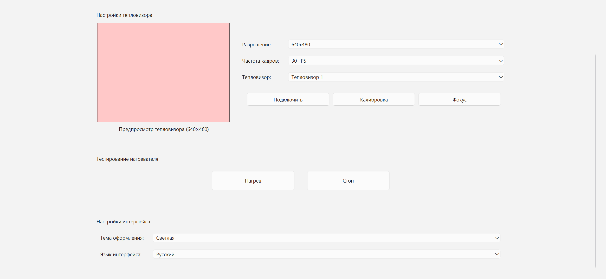
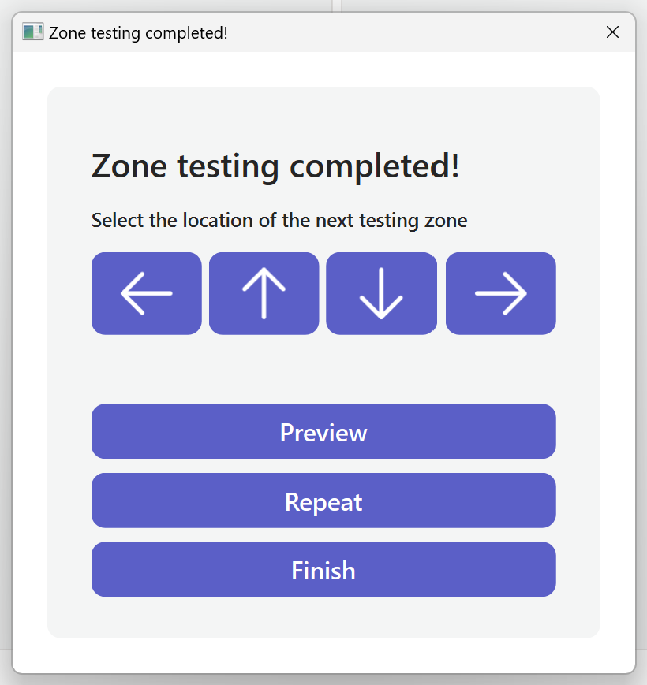
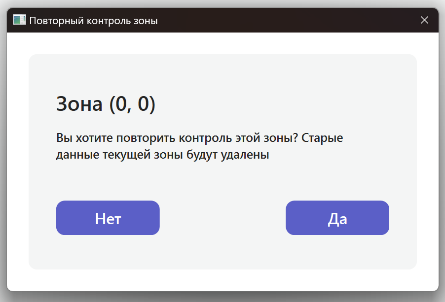
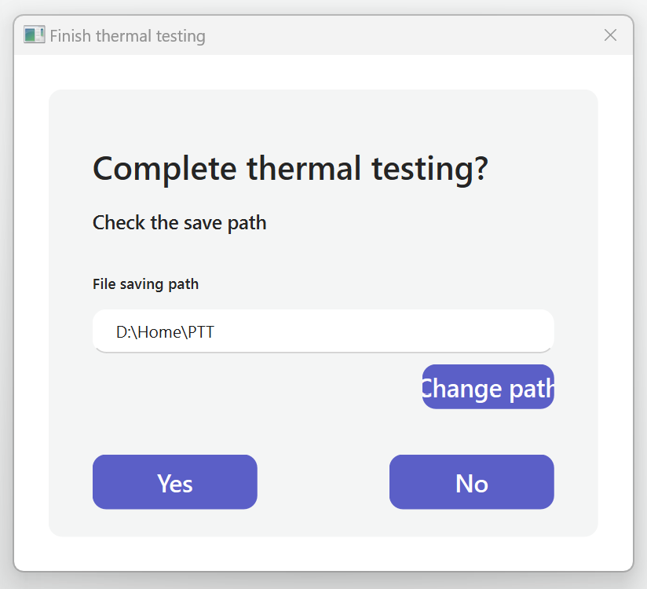

# TPU-TNDT-DualCam-App


Десктопное приложение на Python/PySide6 для управления тепловым дефектоскопом с двумя камерами (ИК + RGB) и нагревательными элементами. Работает на Windows-планшетах и предназначено для неразрушающего контроля.

## 🎯 Цели и задачи проекта

**Научная цель:** разработка программного обеспечения для автоматизации процесса активного теплового неразрушающего контроля (ТНК) с использованием синхронной записи данных с инфракрасной камеры и камеры видимого спектра.

### Технические задачи

* Создание GUI для работы в промышленных условиях на сенсорном планшете.
* Обеспечение синхронного управления камерами (Optris PI 640, FLIR Blackfly S) и контроллером нагревателя.
* Построение гибкой системы, пригодной для продолжения разработки и модификации силами небольшой команды разработчиков.

## ⭐ Основные возможности

### Реализовано

* **Адаптивный интерфейс**
  * [x] Сенсорное управление на планшете с ОС Windows 10/11
  * [x] Автоматическое открытие экранной клавиатуры Windows
  * [x] Стартовая форма авторизации оператора дефектоскопа
  * [x] Валидация путей сохранения и пользовательских данных
  * [x] Окно настроек оборудования и UI

* **Работа с камерами**
  * [x] Поддержка тепловизоров Optris через `libirimager.dll`
  * [x] Поддержка камер FLIR Blackfly S через `PySpin`
  * [x] Поддержка USB-камер через `OpenCV`
  * [x] Одновременный вывод ИК и RGB изображений
  * [x] Запись видео с обеих камер
  * [x] Автоматическое переподключение при обрыве связи

* **Процесс контроля**
  * [x] Автоматизированный цикл: нагрев → охлаждение
  * [x] Progress-bar с анимацией для визуализации процесса
  * [x] Система зон контроля с координатной сеткой
  * [x] Диалоговые окна для управления процессом (`Trajectory`, `Retest`, `Finish`)

* **Системные функции**
  * [x] Настройки с сохранением в `JSON`
  * [x] Логирование для отладки

### В разработке

* **Расширенные функции тепловизора** (всё реализовано в optris_test.py, но ещё не интегирировано)
  * [ ] Температурные измерения в реальном времени (точка, средняя по кадру)
  * [ ] Выбор режима калибровки (авто/ручной)
  * [ ] 8 цветовых палитр для визуализации
  * [ ] Множественные форматы сохранения (PNG, CSV, NumPy, avi, ravi)
  * [ ] Сохранение снимков с метаданными (температуры чипа, флага, корпуса и др.)

* **Анализ данных**
  * [ ] Интеграция алгоритмов постобработки:
    * FFT (Быстрое преобразование Фурье)
    * PCA (Анализ главных компонент)
    * Background Subtraction (Вычитание фона)
    * AVG (Усреднение)
    * и других
  * [ ] Наложение изображений с регулируемой прозрачностью

### В планах

* **Визуализация и анализ**
  * [ ] Окно предпросмотра (`Preview`) с картой зон и графиками
  * [ ] 2D-визуализация тепловых данных
  * [ ] 3D-визуализация тепловых данных
  * [ ] Склейка обработанных термограмм зон
  * [ ] ML-алгоритмы обнаружения дефектов

* **Системные улучшения**
  * [ ] Мультиязычный интерфейс
  * [ ] Тёмная тема оформления UI

## 🔌 Целевое аппаратное обеспечение

Данное ПО изначально предназначалось для запуска на следующем оборудовании:

### 📱 Сенсорный планшет Cyberbook T116K

* Windows 10 IoT
* 10,1" 1920x1200
* Intel m3-6Y30
* 4 GB RAM
* 128 GB ROM
* Wi-Fi, BT, LTE, GPS

### 📸 Промышленная камера видимого спектра Teledyne FLIR IIS Blackfly S GigE (BFS-PGE-27S5C-C)

* Сенсор: Sony IMX429, CMOS, 2/3"
* Размер пикселя: 4,5 мкм x 4,5 мкм
* Разрешение: 1936 × 1464 (2,8 МП)
* Глубина цвета: 12 бит
* Макс. частота кадров: 43 FPS
* Интерфейс: Gigabit Ethernet (GigE) с поддержкой PoE
* Питание: Power over Ethernet (PoE) или внешнее 8–24 В через GPIO

### 📸 Промышленный тепловизор Optris PI 640

* Датчик: UFPA
* Размер пикселя: 17 мкм x 17 мкм
* Разрешение: 640 × 480 (0,3 МП)
* Диапазон температур: –20 °C до 1500 °C
* Погрешность: ±2 °C или ±2%
* NETD: 75 мК
* Макс. частота кадров: 32 FPS
* Интерфейс: USB 2.0

### 🔥 Контроллер нагревателя

Микроконтроллер, управляющий нагревательными элементами с помощью твердотельных реле. Подключен по COM-порту с использованием модуля [serial_communicator](https://github.com/RadioPizza/serial_communicator).

## 🎬 Демонстрация работы

### Стартовое окно



### Основное окно



### Окно настроек





### Окно предпросмотра

_Разработка окна предпросмотра в планах_ (см. Issue [#15](https://github.com/RadioPizza/TPU-TNDT-DualCam-App/issues/15))

### Окно выбора траектории



### Окно подтверждения повторного контроля зоны



### Окно завершения работы



## 🛠️ Руководство разработчика

### 📁 Структура проекта

_Здесь будет описана ключевая структура папок и файлов._ (см. Issue [#24](https://github.com/RadioPizza/TPU-TNDT-DualCam-App/issues/24))

### 🚀 Быстрый старт

#### Предварительные требования

* Windows 10/11
* Python 3.10

1. Установите системные зависимости:

   * [Optris PI Connect](https://www.optris.com/optris-pi-connect)
   * [FLIR Spinnaker SDK](https://www.flir.com/products/spinnaker-sdk/)

2. Склонируйте репозиторий

   ```bash
   git clone https://github.com/RadioPizza/TPU-TNDT-DualCam-App.git
   ```

3. Настройте виртуальное окружение с интерпретатором  Python **3.10**

   ```bash
   cd TPU-TNDT-DualCam-App
   python -m venv venv
   venv\Scripts\activate  # Windows
   ```

4. Установите зависимости

   ```bash
   pip install -r requirements.txt
   ```

5. Запускайте

   ```bash
   python main.py
   ```

### 🎨 Работа с .ui файлами в Qt Designer

На начальных этапах разработки интерфейс разрабатывался в Qt Designer с последующей конвертацией в Python-код. На текущий момент такой подход уже не применяется для окна настроек, в планах отказаться от этого подхода и для всех остальных окон - либо сделать аналогично текущей реализации SettingsWindow.py, либо перейти на QML (см. Issue [#21](https://github.com/RadioPizza/TPU-TNDT-DualCam-App/issues/21)).

#### Запуск Qt Designer

```bash
pyside6-designer
```

#### Рабочий процесс

После редактирования .ui файлов выполните:

```bash
# Конвертация окон
pyside6-uic ui/StartDialog.ui -o StartDialog.py
pyside6-uic ui/MainWindow.ui -o MainWindow.py
pyside6-uic ui/TrajectoryDialog.ui -o TrajectoryDialog.py
pyside6-uic ui/RetestDialog.ui -o RetestDialog.py
pyside6-uic ui/FinishDialog.ui -o FinishDialog.py

# Конвертация ресурсов
pyside6-rcc res_rs.qrc -o res_rs.py
```

**Важно:**
- Уже сконвертированные файлы не следует редактировать, т.к. все изменения будут стёрты при следующей конвертации из ui-файла. 
- После конвертации исправьте импорт ресурсов (в каждом сгенерированном файле нужно заменить `import res-rs_rc` на `import res_rs`): <!-- TODO: Это старая ошибка, надо бы исправить -->

```bash
sed -i 's/import res-rs_rc/import res_rs/g' *.py
```

### 📝 Conventional Commits

Используем [Conventional Commits](https://www.conventionalcommits.org/):

**Основные типы:**
* `feat:` - новая функциональность
* `fix:` - исправление ошибок
* `docs:` - изменения в документации
* `style:` - изменения, не влияющие на логику кода
* `refactor:` - рефакторинг кода без изменения функциональности
* `perf:` - изменения, улучшающие производительность
* `test:` - добавление или исправление тестов
* `build:` - изменения в системе сборки или внешних зависимостях
* `chore:` - вспомогательные задачи (обновление зависимостей и т.п.)
* `revert:` - отмена коммита

### 📋 Управление задачами

Все задачи отслеживаются в [GitHub Project Board](https://github.com/users/RadioPizza/projects/4)

### Сборка и деплой

_Здесь будет описана процедура сборки исполняемого файла и развертывания приложения на целевом устройстве._

<!-- TODO: Добавить инструкцию по копированию на планшет -->
